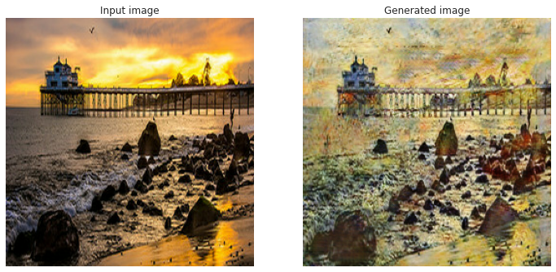

# MonetStyle: Transforming Photos into Monet-esque Paintings with CycleGANs

[](https://colab.research.google.com/github/codebywiam/painting-cyclegan/blob/master/MonetStyle_CycleGAN.ipynb)


## Overview

This project implements a CycleGAN (Generative Adversarial Network) to transfer the artistic style of Claude Monet's paintings to regular photographs. It demonstrates unpaired image-to-image translation, where the model learns to capture the essence of Monet's style—including his distinctive color palettes, brush strokes, and overall impressionistic feel—and apply it to new photos without requiring directly corresponding pairs of photos and paintings.

The goal is to understand and implement a CycleGAN, successfully transfer artistic style, and explore its architecture, including generators, discriminators, and key loss functions (adversarial, cycle-consistency, and identity).

## Table of Contents

1.  [Project Goal](#project-goal)
3.  [Technologies Used](#technologies-used)
4.  [Dataset](#dataset)
5.  [Model Architecture Overview](#model-architecture-overview)
    *   [Generator](#generator)
    *   [Discriminator](#discriminator)
    *   [Loss Functions](#loss-functions)
7.  [Setup and Installation](#setup-and-installation)
8.  [Usage](#usage)
    *   [Training the Model](#training-the-model)
    *   [Performing Style Transfer (Inference)](#performing-style-transfer-inference)
9.  [Results](#results)
10. [Challenges & Learnings](#challenges--learnings-optional)
11. [Future Work](#future-work)
13. [Acknowledgements](#acknowledgements)

## Project Goal

The primary goals of this project are to:
*   Understand and implement a CycleGAN for unpaired image-to-image translation.
*   Successfully transfer the artistic style of Monet paintings to photographs.
*   Explore the architecture of CycleGANs, including U-Net like generators, PatchGAN discriminators, and the crucial roles of adversarial, cycle-consistency, and identity loss functions.
*   Provide a working example of style transfer that can be adapted for other artistic styles or image domains.

## Technologies Used

*   Python 
*   TensorFlow 
*   Keras (tf.keras)
*   NumPy
*   Matplotlib

## Dataset

The dataset used is a subset from the Kaggle competition ["I'm Something of a Painter Myself"](https://www.kaggle.com/competitions/gan-getting-started/data).
*   It contains Monet paintings (Domain B) and landscape photographs (Domain A).
*   For this project, a subset of 300 Monet paintings and 300 landscape photographs (`data/monet_jpg_300`) and (`data/photo_jpg_300`) is used for demonstration and manageable training.


## Model Architecture Overview

CycleGAN involves two generator networks ($G_{AB}$: Photo $\rightarrow$ Monet, $G_{BA}$: Monet $\rightarrow$ Photo) and two discriminator networks ($D_A$: distinguishes real Photos from fake Photos; $D_B$: distinguishes real Monet paintings from fake Monet paintings).

### Generator
The generator architecture is a U-Net like encoder-decoder structure:
*   **Downsampling Blocks:** Each block consists of a `Conv2D` layer, `GroupNormalization` (used as Instance Normalization), and `LeakyReLU` activation. The Normalization helps remove image-specific contrast information, beneficial for style transfer.
*   **Upsampling Blocks:** Each block uses a `Conv2DTranspose` layer, `GroupNormalization`, and `ReLU` activation. Dropout is applied in some upsampling layers to prevent overfitting.
*   **Skip Connections:** Concatenate feature maps from downsampling layers to corresponding upsampling layers, helping preserve low-level image details.
*   The final layer uses a `tanh` activation to output images normalized to [-1, 1].


### Discriminator
The discriminator uses a PatchGAN architecture:
*   It classifies 70x70 overlapping patches of an input image as real or fake, rather than the entire image. This encourages sharper high-frequency details.
*   It consists of several downsampling `Conv2D` layers, `GroupNormalization` (except for the first layer), and `LeakyReLU` activations.
*   The output is a 2D map of logits (e.g., 30x30x1), where each value represents the "realness" of a patch.


### Loss Functions
*   **Adversarial Loss (BCE):** 
`generator_loss`, `discriminator_loss` – Pushes the generator to create realistic images and the discriminator to distinguish them.
*   **Cycle Consistency Loss (L1):** `calc_cycle_loss` – Enforces $F(G(A)) \approx A$ and $G(F(B)) \approx B$. Crucial for unpaired data. Weighted by `lambda_cycle`.
*   **Identity Loss (L1):** `identity_loss` – Encourages $G(B) \approx B$ and $F(A) \approx A$. Helps preserve color and characteristics of the source image when it already matches the target domain. Weighted by `lambda_identity_factor * lambda_cycle`.

## Setup and Installation

1.  **Clone the repository:**
    ```bash
    git clone https://github.com/codebywiam/MonetStyle-CycleGAN.git
    cd MonetStyle-CycleGAN
    ```
2.  **Create and activate a virtual environment (recommended):**
    ```bash
    python -m venv venv
    source venv/bin/activate  # On Windows: venv\Scripts\activate
    ```
    Alternatively, using Conda:
    ```bash
    conda create -n monetgan python=3.9  # Or your preferred Python version
    conda activate monetgan
    ```
3.  **Install dependencies:**
    ```bash
    pip install -r requirements.txt
    ```


## Usage

The primary way to use this project is through the Jupyter Notebook `MonetStyle_CycleGAN.ipynb`.

### Training the Model
1.  Open `nbb.ipynb` in a Jupyter environment (e.g., Jupyter Lab, VS Code, Google Colab).
2.  The dataset (`gan_getting_started_300.zip`) will be automatically downloaded and unzipped when running the initial data loading cells.
3.  Locate the "Model Training" section. Uncomment the `cycle_gan_model.fit(...)` cell.
4.  **Hyperparameters:** Key training parameters like `EPOCHS_TO_TRAIN`, `lambda_cycle`, and `lambda_identity` are defined in the notebook. Adjust as needed. Adam optimizer with $\beta_1=0.5$ and learning rate $2 \times 10^{-4}$ is used.
5.  Run all cells in the notebook. Training can be time-consuming. For the provided subset of 300 images per domain:
    *   On a Google Colab TPU, one epoch takes approximately X-Y minutes.
    *   Training for 25-50 epochs is recommended for good results.
6.  **Saving Models:** After training, you can save the generator weights or the full model as shown in the notebook.

Before we load the trained `monet_generator`, we present to you a screenshot of the CycleGAN's training history. Even though only the monet generator is needed for the style transfer task, but you can see that the losses of all 4 networks: monet generator, monet discriminator, photo generator, and photo discriminated, were being optimized. 


### Performing Style Transfer (Inference)
You can use a pre-trained Monet generator (provided in the notebook) or the own trained model.

1.  **Load the Generator:**
    The notebook provides code to download and load a pre-trained Monet generator (trained for ~50 epochs) using `TFSMLayer` for Keras 3 compatibility:
    
2.  **Transform an Image:**
    The `display_generated_images` function in the notebook can be used or adapted.

## Results
**Example Output:**




## Challenges & Learnings 

*   *GAN Training Stability: GANs can be notoriously hard to train. Ensuring a balance between generator and discriminator updates was crucial.*
*   *Hyperparameter Tuning: Finding optimal weights for cycle-consistency and identity losses required experimentation.*
*   *Computational Resources: Training deep GAN models is computationally intensive. Leveraged Google Colab TPUs for faster iterations.*
*   *Understanding Unpaired Translation: Deepened understanding of how cycle-consistency loss enables translation without paired data.*)

## Future Work

*   **Train for More Epochs:** Achieve higher fidelity and more convincing Monet-style outputs.
*   **Experiment with Different Styles:** Adapt the model to transfer styles of other artists (e.g., Van Gogh, Picasso) or other image domains (e.g., day-to-night, sketch-to-photo).
*   **Quantitative Evaluation:** Implement metrics like FID (Fréchet Inception Distance) to quantitatively assess the quality of generated images, although subjective visual inspection remains important for artistic tasks.
*   **Web Application:** Develop a simple web interface using Streamlit or Gradio for users to upload their photos and get Monet-styled versions.
*   **Architecture Modifications:** Experiment with different generator or discriminator architectures (e.g., attention mechanisms, different normalization layers).


## Acknowledgements

*   This project is based on the principles of CycleGAN, introduced in the paper: [Unpaired Image-to-Image Translation using Cycle-Consistent Adversarial Networks](https://arxiv.org/abs/1703.10593) by Jun-Yan Zhu, Taesung Park, Phillip Isola, and Alexei A. Efros.
*   Dataset sourced from Kaggle's ["I'm Something of a Painter Myself"](https://www.kaggle.com/competitions/gan-getting-started/data) competition.
*   The notebook structure and some implementation details were inspired by public CycleGAN tutorials and examples, including the one by Amy Jang on Kaggle.

## License

This project is licensed under the MIT License. See the LICENSE file for details.